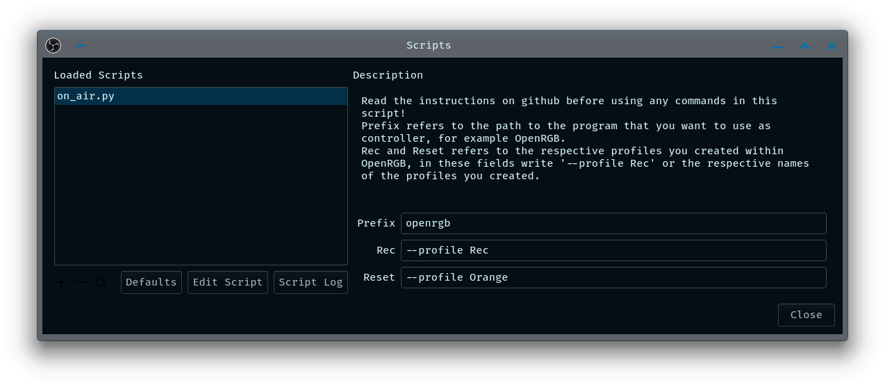
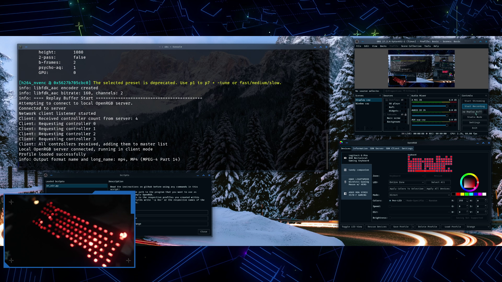
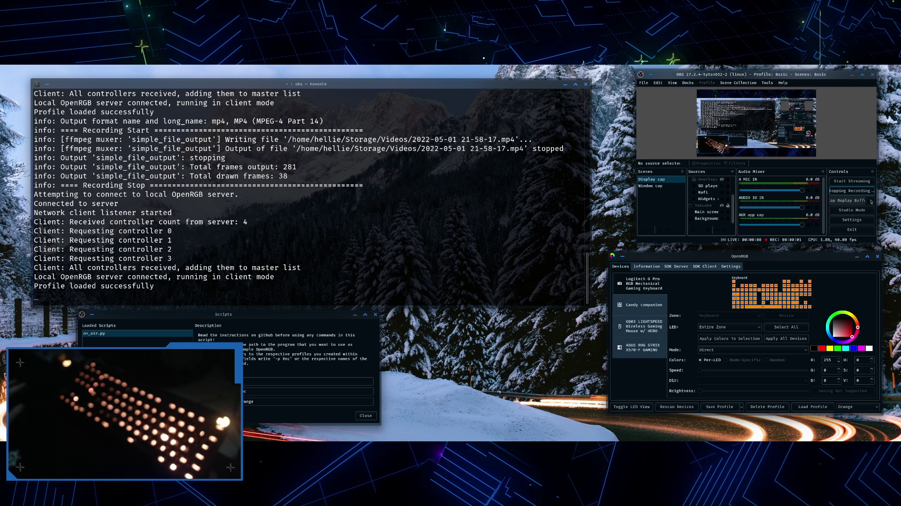

# OBStoshell_on_air_indicator_helper
A small python script that allows you to execute shell commands when starting/stopping stream/recording
Orignally intended to control the RGB lighting on keyboards etc to give you a visual feedback that OBS is streaming/recording

you can see the script in action at https://twitter.com/HelWinther/status/1520856772986159104?s=20&t=eCrtoiAcRLPRbATLPV24tw
# Prerequisits

https://gitlab.com/CalcProgrammer1/OpenRGB/-/releases/
you will need something like OpenRGB or similar with capacity to handle input from shell commands (for now)

# Instructions to set the script and OpenRGB up

1. install/download OpenRGB, if on Windows mind where the folder where the executable is placed as you will have to write out the full path to the exe file.
2. in case you only want some deviced to be used for this "on air" indication, open up OpenRGB and find "Supported Devices" under the settings tab, disable all the devices except the devices you want to use for the "on air" indication. Keep in mind that software like iCUE, G hub and so on will most likely interfere with OpenRGB so be aware of this.
3. optional but will make the script change the light quicker... under general settings, enable "Start At Login", "Start Server" and "Set Server Port: 6742". this is optional but if this isn't set there will be about a 3-5 second delay between clicking record/stream in OBS. You can enable "start minimized" and "minimize on close" to keep OpenRGB out of the way.
4. now create a minimum of 2 profiles, one that is how your lights will look when you're streaming/recording and another that will set your lights back to how they where once you end recording/stream.
5. with that setup go into OBS and under the tools menu select scripts, use the + to open up the file explorer of your system and navigate to find the script you downloaded from here and load it up into OBS.
6. here is where the tricky bit may start:

Windows users:
	you will need to write the full path to the exe file of OpenRGB in the "Prefix" field, "C:\Users\[your username]\OpenRGB\OpenRGB.exe" as an example and yes use \ instead of /, in the Rec field write "--profile 'name of the recording profile'" and "--profile 'Reset to normal name profile'" in the reset field.

Linux users:
	you will need to write the command used to launch OpenRGB from a terminal into the prefix field, "openrgb" should be the command unless changed, as for the windows users write "--profile 'Rec/Reset profile names'" into the respective Rec and Reset fields.

if all been setup correctly it should be changing the lights of your device when you click "Start/Stop Streaming/Recording"

# Possible Improvements changes
as of right now, not sure, tho if you have ideas be sure to let me know!

